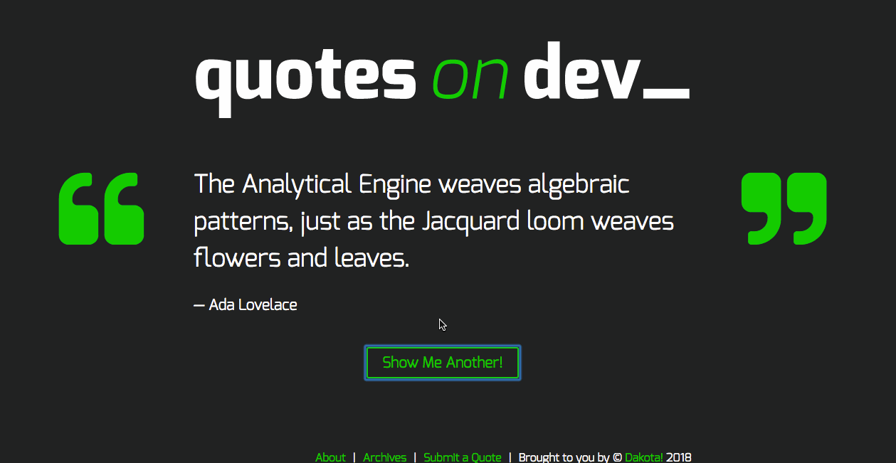

# Quotes on Dev

School project to build the functionality for a website called Quotes on Dev (in mock of Quotes On Design) using the Wordpress REST API.

## Key Features

This website uses javascript for a few key features:

1. Uses Ajax to make a GET request to a WP API endpoint to dynamically add a new quote to the front page when a user clicks the 'Get a new Quote' button, and updates the URL using the history API.
2. Uses Ajax to make a POST request to submit a new quote to the site, but only when a user is logged in.
3. Clears the quote submission form and shows a success message when a quote is successfully submitted to the database.
4. Shows an error message when a quote is not successfully submitted to the database.

This website is also responsiveley designed using a mobile-first approach for mobile, tablet and desktop views.
It also uses Gulp for running build tasks, such as minification and error checking, and uses SASS as a css pre-processor.

## Personal Learnings

1. How to incorporate Javascript into Wordpress by properly enqueue-ing CSS and javascript files in the functions.php file.
2. How to leverage the WP template hierarchy to edit the correct pages.
3. How to properly use Ajax and what data to pass in for certain post types. 

## License

[MIT](LICENSE)